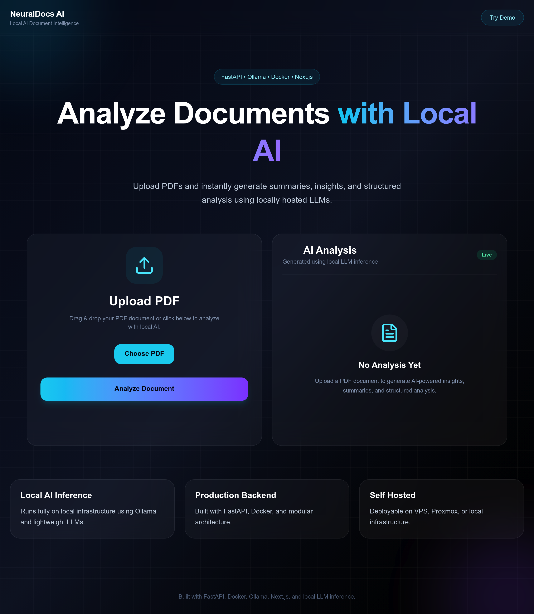

# NeuralDocs — Local AI Document Intelligence

> Analyse PDFs privately. No cloud. No data leaving your machine. No API keys.



🚀 **Live Demo:** [ai-doc.kgup.me](https://ai-doc.kgup.me)

---

## Why NeuralDocs?

Every PDF analysis tool today sends your documents to OpenAI, Google, or Anthropic.
That's fine for public data — but not for contracts, medical records, research papers,
or internal reports.

NeuralDocs runs entirely on your own hardware. The LLM inference stays local via Ollama,
your files never leave your machine, and the whole stack deploys with a single
`docker compose up`.

**Built for:**
- Developers who want a self-hosted alternative to ChatPDF or Adobe AI
- Teams handling sensitive documents (legal, medical, financial)
- Anyone running a home server, VPS, or Proxmox node who wants real AI tooling

---

## What it does

- 📄 Upload any PDF and get structured summaries instantly
- 💬 Ask questions about the document — get precise, cited answers
- 🔒 100% local inference via Ollama (Llama 3, Mistral, Phi-3 — your choice)
- 🚀 One-command deployment via Docker Compose
- 🖥️ Runs on a VPS, Proxmox, bare-metal, or your laptop

---

## How It Works

```
                                        ┌──────────────────────┐
                                        │      PDF Upload      │
                                        └──────────┬───────────┘
                                                │
                                                ▼
                                        ┌──────────────────────┐
                                        │  Text Extraction     │
                                        │      (pypdf)         │
                                        └──────────┬───────────┘
                                                │
                                                ▼
                                        ┌──────────────────────┐
                                        │   LLM Processing     │
                                        │ (Ollama + Llama 3)   │
                                        └──────────┬───────────┘
                                                │
                                                ▼
                                        ┌──────────────────────┐
                                        │ Structured Analysis  │
                                        │       Response       │
                                        └──────────────────────┘
```

Upload a PDF → text is extracted and sent to your local Ollama instance → the LLM returns structured insights directly in the browser.

---

## Tech Stack

| Layer    | Technology                        |
| -------- | --------------------------------- |
| Frontend | Next.js, React, JavaScript, CSS   |
| Backend  | Python, FastAPI                   |
| LLM      | Ollama (Llama 3.2 3B by default)  |
| PDF      | pypdf                             |
| Deploy   | Docker, Docker Compose            |

---

## Prerequisites

- **Docker** and **Docker Compose** installed
- **[Ollama](https://ollama.com)** running and accessible on your network with a model pulled, e.g.:
  ```bash
  ollama pull llama3.2:3b
  ```

---

## Configuration

Copy `example_env` to `.env` and update the values for your setup:

```bash
cp example_env .env
```

```env
# URL of your Ollama server
OLLAMA_SERVER_URL=http://192.168.1.21:11434

# Ollama model to use for analysis
OLLAMA_MODEL=llama3.2:3b

# Max characters extracted from PDF (keep lower for smaller models)
PDF_CHAR_EXTRACTION_LIMIT=4000

# URL of the frontend (used for CORS)
FRONTEND_URL=http://192.168.1.20:3000

# Backend API URL exposed to the frontend
NEXT_PUBLIC_API_URL=http://192.168.1.20:8000
```

> **Note:** Replace the IP addresses with your actual server IPs. If running everything on one machine, use `localhost` or `127.0.0.1`.

---

## Getting Started

### 1. Clone the repo

```bash
git clone https://github.com/kshitijqwerty/analyze-doc-local-llm.git
cd analyze-doc-local-llm
```

### 2. Configure environment

```bash
cp example_env .env
# Edit .env with your Ollama server URL and IPs
```

### 3. Build and run

```bash
docker compose build
docker compose up -d
```

### 4. Open the app

```
http://<YOUR_SERVER_IP>:8000
```

---

## Project Structure

```
analyze-doc-local-llm/
├── backend/        # Python/FastAPI server — PDF extraction + Ollama integration
├── frontend/       # Next.js app — upload UI and results display
├── compose.yaml    # Docker Compose config
├── example_env     # Environment variable template
└── .gitignore
```

---

## Tips

- **PDF size:** Large PDFs may be truncated based on `PDF_CHAR_EXTRACTION_LIMIT`. Increase this value if your model can handle larger context windows.
- **Model choice:** `llama3.2:3b` is a good default for low-resource machines. For better quality, try `llama3:8b` or `mistral` if your hardware supports it.
- **Performance:** Running Ollama on a machine with a GPU will significantly improve inference speed.

---

## License

MIT